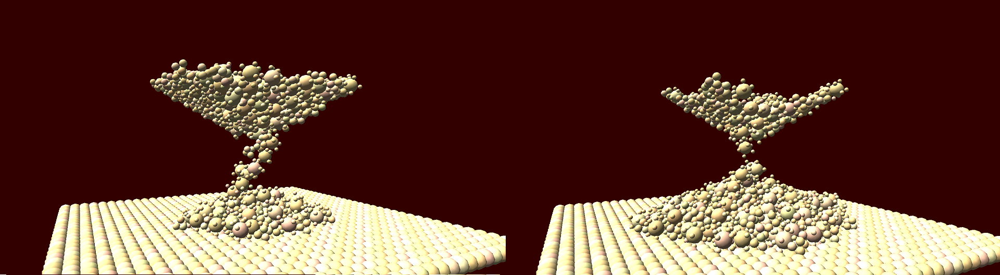
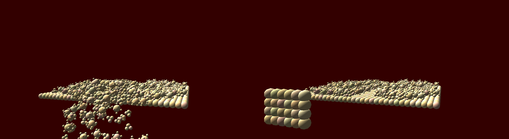
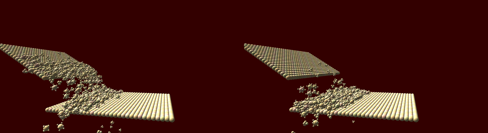

This is a particle-based simulator I wrote from scratch. It is an implementation
of the research paper ["Particle-Based Simulation of Granular Materials"](http://wnbell.com/media/2005-07-SCA-Granular/BeYiMu2005.pdf).

The simulator allows for interactions between thousands of grains, with each grain
made up of several particles constrained as a rigid body in the shape of a cube,
tetrahedron, or sphere. The simulator also extends to interactions between rigid
bodies and particles. Currently only planes are supported, but future support will
be added for generic 3d meshes as well.

Simulation of grains as rigid bodies required the implementation of rigid body
concepts such as force, torque, moment of inertia tensors, and friction. Collisions
between particles is handled as a repulsive spring force which increases the more
the particles overlap. This allows particles to come to rest in contact. Static
friction is determined by the irregular shaping of individual grains, allowing them
to catch on one another and stack on top of each other, forming piles with an angle
of repose.

An interactive simulation viewer is provided, which allows the user to view the
simulation from different angles and change its playback speed. The viewer was 
implemented using the game engine I developed for a game called "The Gauntlet".

The simulator implements several ODE integrators, namely:
- Euler Method
- Verlet Method
- Runge-Kutta Fourth Order Method
- Runge-Kutta-Fehlberg Fourth-Fifth Method with adaptive step sizing

In this simulation, particles are constrained to an invisible hourglass. The friction
among particles and between particles and the walls of the invisible hourglass
prevent the particles from falling down all at once. Instead, they slowly trickle
out of the opening at the middle of the hourglass and form a heap on the ground.

In this simulation, a pile of particles is on the ground. A plane sweeps across
the ground like a snow plow, pushing particles off the edge of the floor and 
carving a path through the mound of particles.

In this simulation, particles slide down a hill and collect at the bottom
like an avalanche.

